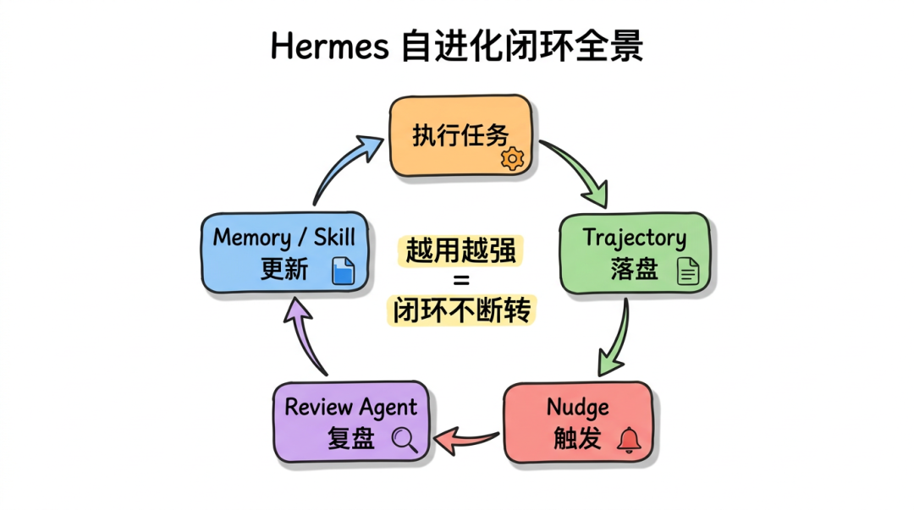
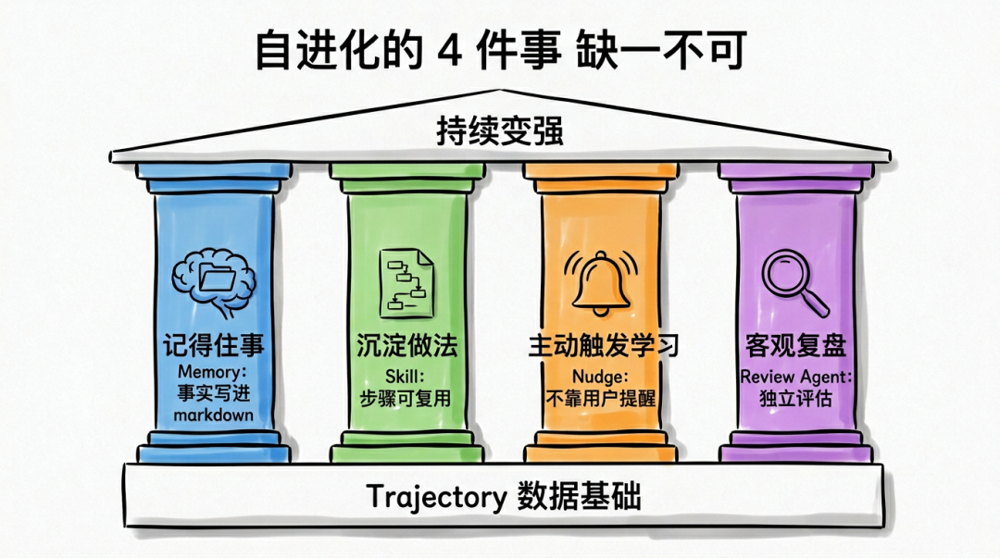
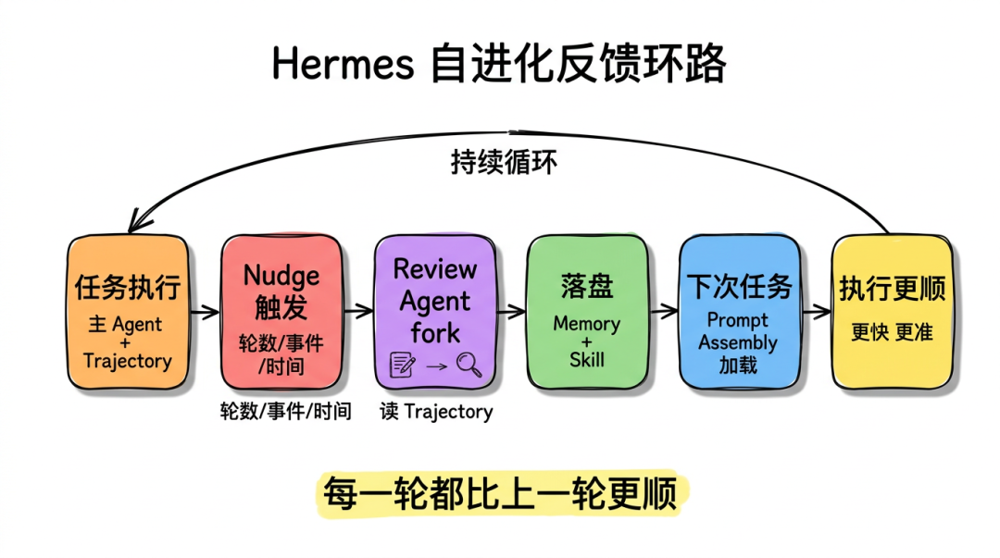
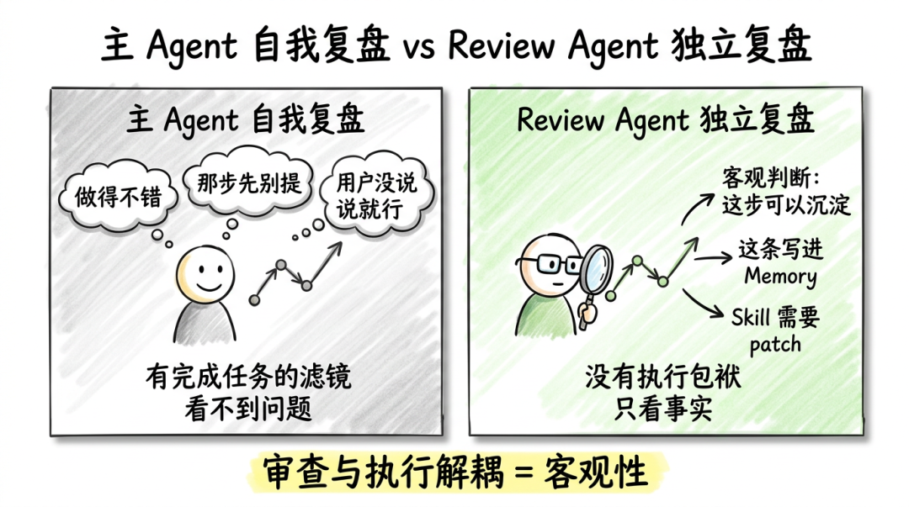

# Self-Improving 总览：Hermes 为什么会越用越强

点击上方 前端Q，关注公众号

回复加群，加入前端Q技术交流群

我跟很多做 Agent 的朋友聊过一个话题：**Agent 真的能"自我进化"吗？**

大家给的答案多半是：

▸"可以啊，模型越来越强嘛"▸"可以啊，prompt 越调越好啊"▸"可以啊，加点 RAG 不就行了"

听起来好像都对。但你仔细一想会发现，这些都是**外部在帮 Agent 变强** ，不是 Agent 自己在变强。

模型迭代是 OpenAI 的事，prompt 调优是工程师的事，RAG 是知识库的事。Agent 自己呢？它一直在原地，每次任务都从零开始。

Hermes 的"Self-Improving"不一样。它说的是：**Agent 自己能从工作中学到东西，自己写下来，自己下次复用，自己持续修补** 。

整个闭环不依赖人，也不依赖模型升级。

这一篇我把这个闭环拆开讲清楚。读完之后你应该能回答一个问题：**究竟是什么让 Hermes 在一周之后比一周之前强？**

## 先给"自进化"做一个工程定义

很多文章把"自进化 Agent"讲得很玄。我倾向于把它落地成一个工程标准。

我自己用的判断标准很简单 —— **同一个用户，让同一个 Agent，在不同时间点做同类任务，后做的明显比先做的更准更快** 。

注意三个关键词：

▸**同一个用户** ：排除 prompt 优化的影响▸**同一个 Agent 实例** ：排除模型版本升级的影响▸**同类任务** ：排除任务难度变化的影响

如果一个 Agent 满足这个标准，那它就是真的在自进化。

不满足？那不管它声称自己有多智能，本质都还是个一次性工具。

按这个标准，市面上 95% 的 Agent 不算自进化。Hermes 算。

## 自进化要靠 4 件事配合

我研究下来发现，"越用越强"这件事不是单点能力，是 4 件事环环相扣。

少任何一件，闭环都跑不起来。

**第 1 件事：能记住事**

听起来废话，但绝大多数 Agent 真的记不住事。

你这次告诉它"我们项目用 pnpm 不用 npm"，下次它还是 npm。你纠正过它三次，第四次它还是从头来。

记不住事，等于每次都是新员工。

Hermes 通过 Memory 解决：**事实级别的认知，要写到 markdown 文件里，下次自动加载到 system prompt** 。

**第 2 件事：能沉淀做法**

记住事实只是基础。真正决定快慢的是"做事的步骤"。

比如我让 Agent 部署一个服务，第一次它要试 5 种命令。如果它把成功的那条路记下来，下次直接用，那就快了。

Hermes 通过 Skill 解决：**操作级别的经验，要写成有 step 的 markdown 文件，下次按攻略执行** 。

**第 3 件事：能主动触发学习**

光给 Agent 一个 Memory 文件不够。如果它不主动 review、不主动写，文件永远是空的。

人类也一样。如果你不强制自己每周复盘，那你今天踩的坑下周还会再踩。

Hermes 通过 Nudge Engine 解决：**到了某个时间点 / 某个事件 / 某个轮次，强制提醒"该学习了"** 。

**第 4 件事：能客观地复盘**

主 Agent 自己复盘最大的问题是 —— 它会偏向认为"我做得很好"，然后什么都不学。

就像没人愿意承认自己写的代码有问题。

Hermes 通过 Review Agent 解决：**专门 fork 一个独立 Agent 来复盘，它没有完成任务的执念，只看快照判断什么值得记** 。

这 4 件事缺一不可。

## 闭环是怎么转起来的

把上面 4 件事串起来，就是 Hermes 的核心闭环：

text

任务执行 (主 Agent + Trajectory 落盘)  
↓  
Nudge 触发 (轮数 / 事件 / 时间)  
↓  
Review Agent fork (读 Trajectory，做判断)  
↓  
落盘 (Memory 加事实 / Skill 创建或 Patch)  
↓  
下次任务 (Prompt Assembly 把 Memory + Skill 拽进 system prompt)  
↓  
执行更顺、更快、更准  
↓  
回到任务执行 (循环)

这是一个真正意义上的反馈环 (feedback loop)，不是单向的。

每一轮的输出，都是下一轮的输入。

每一轮的执行，都在让下一轮更好。

只要你坚持用，闭环越转越紧，Agent 越用越强。

## 为什么这个闭环必须包含"主动触发"

我看过不少 Agent 项目尝试做"自进化"，最常见的失败方式是 —— **没有主动触发机制** 。

它们的逻辑通常是：

▸等用户主动反馈"刚才那个不对"，才去更新▸等用户主动说"记住这件事"，才去存

这是一种"被动学习"。

被动学习有个致命问题：**用户大多数时候不会反馈** 。

用户的诉求是"把活干完"，不是"教 Agent 怎么干得更好"。

如果 Agent 只在用户主动反馈时学习，那它一辈子也学不到几样东西。

Nudge Engine 解决的就是这件事 —— **不依赖用户反馈，到时间了，到轮次了，到事件了，Agent 自己提醒自己复盘一下** 。

这就跟你强制自己每周写周报一样。哪怕没人看，哪怕没人催，写下来这件事本身就让你下周不一样。

## 为什么"复盘"必须由独立 Agent 来做

这是我觉得 Hermes 设计里最聪明的一点。

主 Agent 干完活让它自己 review，会有几个本能性的偏差：

▸"刚才这事我做得不错" → 不学▸"刚才那步有点尴尬，先别提" → 不记▸"用户没说不满意，应该没问题" → 不改

这些都是非常人性的反应，模型也一样。

让另一个独立的 Agent 来 review 就不一样：

▸它没参与执行，没有"我做得好"的滤镜▸它只看快照，看的是事实，不是情绪▸它的唯一任务就是判断"什么值得保存"

这种**审查与执行的解耦** ，让 review 这件事本身有了客观性。

打个比方：你自己写完代码，自己 review，往往看不出问题。同事来 review，分分钟挑出 5 处。Hermes 是把"同事 review"这件事自动化了。

## "进化速度"不是越快越好

很多人会有个误区 —— 觉得 Agent 学得越多越快越好。

我不这么看。

我观察 Hermes 的 Memory / Skill 增长曲线，会发现一个现象：**前两周增长很快，之后趋于平稳** 。

这不是 bug，是设计如此。

因为：

▸Memory 是有上限的，新事实进来要挤旧事实▸Skill 是有触发条件的，无关任务不会触发新 Skill▸Review Agent 是会"否决"的，没价值的快照不会变成新内容

所以好的自进化系统，不是"无限学习一切"，是**只学真正有复用价值的东西，并且持续修剪** 。

这点很反直觉，但工程上必须这样。

如果你让 Agent 把每件小事都记下来，半年后它的 Memory 比《战争与和平》还长，模型读完一半就忘了开头，反而越用越差。

**进化的核心不是膨胀，是高质量的精简** 。

## 自进化的"反例"：哪些设计跑不通

为了让你理解 Hermes 为啥这么设计，我反过来举几个"看着挺好但其实跑不通"的方案：

**反例 1：所有对话都进 Memory**

听起来很合理，"全都记下来肯定不会漏"。

实际跑下来：Memory 几小时就爆了，模型注意力被无关聊天淹没，本来该用上的事实反而被忽略。

**反例 2：让模型 fine-tune 进基模**

听起来更牛，"直接把学到的烧进权重"。

实际：成本巨高，时延巨长，rollback 几乎不可能，跨用户污染严重。普通团队完全跑不动。

**反例 3：用大向量库存历史，每次检索**

听起来现代，"RAG 一切问题"。

实际：检索精度不够，召回的多是相似但无关的内容，反而干扰当下任务。Skill 这种"操作步骤"完全不适合用 embedding 召回。

**反例 4：让用户每次手动告诉 Agent 学了啥**

听起来可控，"用户掌握主动权"。

实际：用户 99% 的时候不会写。半年下来 Memory 几乎是空的。

Hermes 选 markdown + Memory 边界 + Nudge + Review 这套，就是把这些反例都规避了一遍。

## 自进化的"加速度"从哪儿来

我跑了几周 Hermes，发现一个有意思的规律 —— **学习速度本身也会进化** 。

第 1 周：每完成 5-6 个任务，沉淀 1 个 Skill

第 2 周：开始出现 Skill 与 Skill 之间的"互相调用"，新 Skill 站在已有 Skill 上构建

第 3 周：Memory 和 Skill 开始对照，发现 Memory 里有过时事实，自动 patch 修订

第 4 周：Agent 在执行新任务时，会先扫一遍现有 Skill 看有没有可借鉴的，没有再现做

你会发现：**学习不是线性的，是复利的** 。

刚开始很慢，很笨。每天积累一点点。但一旦 Skill 之间产生组合效应，能力增长会进入一个加速期。

这跟人学一门手艺一模一样。前 100 小时最痛苦，第 500 小时开始有"突然就会了"的感觉。

## 自进化和"模型升级"是两件事

最后想强调一点：**自进化不是模型变强，是 Agent 变熟练** 。

模型升级是 OpenAI / Anthropic 给你的能力上限。

自进化是你的 Agent 在你这个特定环境下的"熟练度增长"。

这两件事互相加成但互相独立：

▸没有模型升级，自进化也能让 Agent 在你环境里越来越懂事▸没有自进化，模型再强也会在你这边忘事忘得很快

Hermes 抓的是第二件事 —— 它不试图改基模，它试图让你这个 Agent 在你这个用户、你这个团队、你这个项目里越来越好用。

这点对企业落地意义巨大。后面 Skill Hub 那一章会反复回到这点。

## 我的看法

研究 Hermes 的 Self-Improving 闭环，我最大的感受是 ——

**真正的"自进化"不是一项能力，是一种结构。**

它不是某段聪明的代码，也不是某个魔法 prompt。它是一个由 4 个独立角色 (Memory、Skill、Nudge、Review) 协作出来的反馈环。

每个角色单看都很简单，组合起来才产生"持续变强"的效果。

这其实跟一个团队是怎么变强的一模一样：

▸Memory ≈ 团队 wiki▸Skill ≈ 流程 SOP▸Nudge Engine ≈ 周会复盘提醒▸Review Agent ≈ 同事 code review

人类团队进化几十年沉淀出来的"组织学习"机制，Hermes 用工程方式在一个 Agent 上重新实现了一遍。

理解了这点，你才会明白：**Hermes 的设计哲学，不是 AI 哲学，是组织学** 。

它把 Agent 当成一个团队的新员工来训练，而不是当成一个魔法盒子。

而真正能在企业里落地的 AI 系统，本质上都得回到组织学这件事上。

后面几篇会一块一块拆这 4 个角色的内部机制。这一篇你只要先把闭环装进脑子里就行。

往期推荐

最后点个**在看** 支持我吧