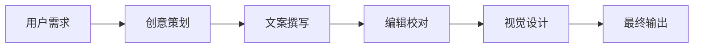

---
name: Day12面试题_标准答案
description: Day12多Agent协作面试题标准答案
type: interview
tags: ["面试题", "标准答案", "多Agent"]
summary: Day12多Agent协作面试题标准答案
created_at: 2026-05-26
updated_at: 2026-05-26
version: interview
---

# Day12 面试题标准答案 ✅

---

## 第 1 题：多 Agent 架构模式

### 标准答案要点：

#### 4 种常见架构模式

| 模式 | 优点 | 缺点 | 适用场景 |
|------|------|------|---------|
| **顺序模式** | 简单清晰、易调试 | 效率低、串行 | 线性流程任务 |
| **并行模式** | 效率高、速度快 | 需要汇总、可能重复 | 独立任务并行 |
| **层次模式** | 协调好、责任清 | 复杂度高、管理者瓶颈 | 复杂项目管理 |
| **混合模式** | 最灵活、适应性强 | 设计难、实现复杂 | 复杂场景 |

#### 详细说明

**1. 顺序模式（Sequential）**
- Agent A → Agent B → Agent C，前一个输出是后一个输入
- 优点：流程清晰，容易理解和调试
- 缺点：串行执行，总时间是各步骤之和
- 例子：内容创作（选题 → 写作 → 编辑 → 发布）

**2. 并行模式（Parallel）**
- 多个 Agent 同时工作，最后汇总
- 优点：效率高，总时间是最慢的那个步骤的时间
- 缺点：需要汇总逻辑，可能产生重复工作
- 例子：竞品分析（同时分析竞品 A/B/C，再汇总）

**3. 层次模式（Hierarchical）**
- 有一个管理者 Agent 协调多个工作者 Agent
- 优点：有中央协调，适合复杂任务
- 缺点：管理者可能成为瓶颈，协调成本高
- 例子：产品开发（产品经理协调设计、开发、测试）

**4. 混合模式（Hybrid）**
- 组合多种模式，灵活适应复杂场景
- 优点：最灵活，可以兼顾效率和质量
- 缺点：设计难度大，实现复杂度高
- 例子：先并行调研，再顺序分析和撰写

---

## 第 2 题：CrewAI 核心概念

### 标准答案要点：

#### 核心概念解释

| 概念 | 作用 | 说明 |
|------|------|------|
| **Agent** | 执行者 | 有角色、目标、工具的智能体 |
| **Task** | 任务 | 给 Agent 的具体工作 |
| **Crew** | 团队 | Agent 组成的协作团队 |
| **Process** | 流程 | 团队协作的方式 |

#### 它们如何配合工作

```
1. 定义多个 Agent（每个有不同角色和专长）
2. 定义多个 Task（每个 Task 指定给一个 Agent）
3. 把 Agent 和 Task 组装成 Crew
4. 指定 Process（顺序/分层/异步）
5. kickoff() 运行
```

#### 伪代码示例

```python
# 1. 创建 Agent
agent = Agent(
    role="产品经理",
    goal="写PRD",
    backstory="有10年经验..."
)

# 2. 创建 Task
task = Task(
    description="写PRD",
    agent=agent,
    expected_output="PRD文档"
)

# 3. 组装 Crew
crew = Crew(
    agents=[agent1, agent2],
    tasks=[task1, task2],
    process=Process.sequential
)

# 4. 运行
result = crew.kickoff()
```

---

## 第 3 题：好的 Agent 设计

### 标准答案要点：

#### 三要素

| 要素 | 说明 | 示例 |
|------|------|------|
| **Role** | 清晰的角色 | "资深产品经理"（不是"助手"） |
| **Goal** | 明确的目标 | "输出可执行的PRD"（不是"帮忙"） |
| **Backstory** | 丰富的背景 | 经历、专长、风格、信念 |

#### 完整示例

```python
Agent(
    role="资深产品经理",
    goal="深入理解用户需求，输出清晰可执行的PRD文档",
    backstory="""
    你有10年产品经验，曾在腾讯工作5年，主导过微信支付等核心功能。
    你的专长：用户需求洞察、产品方案设计、跨团队协作。
    你的风格：严谨、务实、有同理心。
    你相信："好的产品是让用户用得爽，不是让产品经理觉得酷"
    """,
    llm=llm,
    verbose=True
)
```

#### 常见错误
- ❌ 角色太模糊："助手"
- ❌ 目标太宽泛："帮忙"
- ❌ 背景太简单："你很厉害"

---

## 第 4 题：单 Agent vs 多 Agent

### 标准答案要点：

#### 选择判断标准

| 维度 | 单 Agent | 多 Agent |
|------|---------|---------|
| **任务复杂度** | 简单、单一任务 | 复杂、多步骤 |
| **技能多样性** | 只需要一种技能 | 需要多种技能 |
| **协作需求** | 不需要协作 | 需要分工协作 |
| **效率要求** | 不追求极致效率 | 想并行提速 |

#### 优缺点对比

| 特性 | 单 Agent | 多 Agent |
|------|---------|---------|
| **简单性** | ✅ 简单 | ❌ 复杂 |
| **效率** | ❌ 串行 | ✅ 可并行 |
| **专业性** | ❌ 单一专长 | ✅ 多个专家 |
| **成本** | ✅ 低 | ❌ 高（调用次数多） |
| **调试** | ✅ 容易 | ❌ 困难 |

#### 场景举例

**适合单 Agent 的场景**：
- 写一封邮件
- 翻译一段文字
- 简单的代码生成

**适合多 Agent 的场景**：
- 市场调研 + 分析 + 报告
- 产品设计 + 开发 + 测试
- 创意策划 + 文案 + 编辑

---

## 第 5 题：任务依赖与编排

### 标准答案要点：

#### 常见依赖类型

**1. 顺序依赖**
```
Task A → Task B → Task C
```
```python
task_b = Task(..., context=[task_a])
task_c = Task(..., context=[task_b])
```

**2. 并行 + 汇总**
```
Task A ─┐
Task B ─┼→ Task D (汇总)
Task C ─┘
```
```python
task_d = Task(..., context=[task_a, task_b, task_c])
```

**3. 混合依赖**
```
Task A → Task B ─┐
       └→ Task C ─┼→ Task D
```

#### 编排策略

| 策略 | 说明 | CrewAI 参数 |
|------|------|------------|
| **顺序编排** | 按顺序执行 | `process=Process.sequential` |
| **分层编排** | 管理者协调 | `process=Process.hierarchical` |
| **异步编排** | 并行执行 | `async_execution=True` |

---

## 第 6 题：内容创作团队设计

### 标准答案要点：

#### Agent 设计

| Agent | 角色 | 目标 |
|-------|------|------|
| **策划** | 创意策划 | 选题和创意概念 |
| **作者** | 文案撰写 | 撰写正文 |
| **编辑** | 编辑校对 | 润色和优化 |
| **设计** | 视觉设计 | 设计配图和排版 |

#### 任务编排

```
1. 策划任务（Agent: 策划）
   ↓
2. 写作任务（Agent: 作者，依赖: 策划）
   ↓
3. 编辑任务（Agent: 编辑，依赖: 写作）
   ↓
4. 设计任务（Agent: 设计，依赖: 编辑）
```

#### 架构图



---

## 面试话术建议

### 回答框架（STAR）

- **S**ituation：背景
- **T**ask：任务
- **A**ction：行动
- **R**esult：结果

### 举例

> "在之前的项目中（S），我们需要搭建一个市场调研系统（T），
> 我设计了4个Agent：研究员、分析师、竞品专家、报告撰写人（A），
> 使用顺序+并行的混合模式，最终输出的报告质量提升了30%（R）。"

---

