# DeepSeek V4 来了！百万上下文 + Obsidian 接入实战指南

  

> 写在前面：今天深度求索发布了 DeepSeek-V4 预览版，直接把上下文窗口拉到1M（一百万 token），而且 API 价格依然良心。作为一个 Obsidian 重度用户，第一反应就是——这不得接进我的知识库？下面是模型解读 + Obsidian 接入的完整实操。

* * *

## 一、DeepSeek-V4 是什么？一句话总结

**百万上下文，开源，API 依然便宜。**

DeepSeek-V4 是深度求索全新系列模型，今天（2026-04-24）正式上线预览版并同步开源。两个版本：

模型| 定位| 上下文| 思考模式  
---|---|---|---  
`deepseek-v4-pro`| 旗舰版，比肩顶级闭源| 1M| 支持  
`deepseek-v4-flash`| 经济版，速度更快| 1M| 支持  
  
  

旧模型名即将停用

`deepseek-chat` 和 `deepseek-reasoner` 将于 **2026-07-24** 停止使用。目前两者分别指向 `deepseek-v4-flash` 的非思考模式和思考模式，建议尽快迁移。

* * *

## 二、V4 到底强在哪？

### 1\. 百万上下文，不是噱头

V4 开创了全新的注意力机制——在 token 维度进行压缩，结合 DSA 稀疏注意力（DeepSeek Sparse Attention）。这意味着：

  * 长上下文的计算量和显存需求大幅降低
  * 1M 上下文成为 DeepSeek所有官方服务的标配

对比 V3.2，V4 在超长上下文场景下的计算开销显著下降，这才是百万上下文能"普惠"的根本原因——不是硬堆算力，而是架构创新。

### 2\. Agent 能力大幅增强

V4-Pro 的 Agentic Coding 已经达到开源模型最佳水平。内部评测中：

  * 使用体验优于 Sonnet 4.5
  * 交付质量接近 Opus 4.6 非思考模式
  * 已针对 Claude Code、OpenClaw、OpenCode、CodeBuddy 等主流 Agent 框架做了适配优化

### 3\. 推理能力：开源第一梯队

在数学、STEM、竞赛型代码评测中，V4-Pro 超越所有已公开评测的开源模型，比肩世界顶级闭源模型。

### 4\. V4-Flash：性价比之王

Flash 版本参数更小、激活更快，简单任务上与 Pro 旗鼓相当，API 更便宜。日常笔记摘要、知识问答这类场景，Flash 完全够用。

如何选择？

  * 复杂 Agent 场景（代码生成、长文档分析）→ **V4-Pro** ，开启思考模式，`reasoning_effort` 设为 `max`
  * 日常对话、笔记处理、快速问答 → **V4-Flash** ，省钱又快

* * *

## 三、Obsidian 接入 DeepSeek-V4 实战

重点来了！！！Obsidian 本身不支持 AI，但社区插件生态已经非常成熟。以下是三种主流接入方式，按推荐程度排序。

### 方案一：Copilot 插件

Obsidian Copilot 是目前最成熟的 AI 辅助插件，支持自定义 OpenAI 兼容 API。更多参考：

**Step 1：安装插件**

设置 → 第三方插件 → 搜索 `Copilot` → 安装并启用

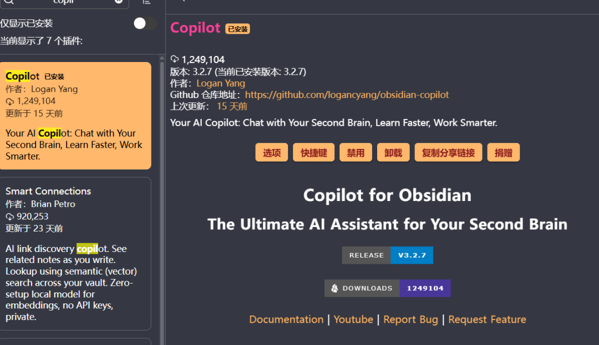

  

**Step 2：获取 DeepSeek API Key**

前往 platform.deepseek.com 注册并创建 API Key

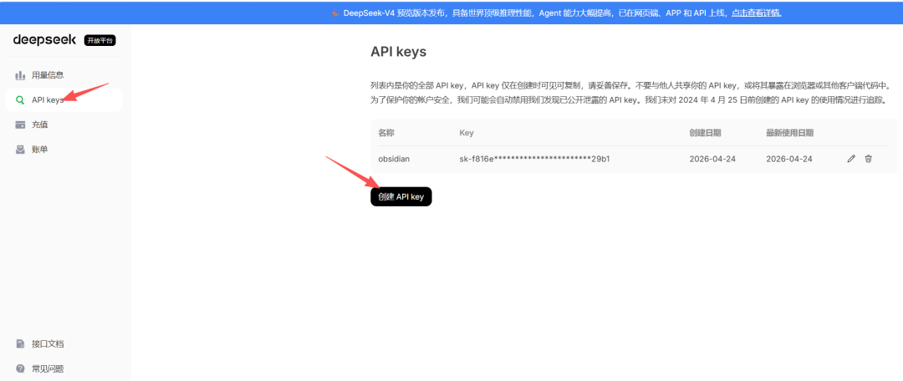

  

**Step 3：配置 Copilot**

在 Copilot 设置中填写：

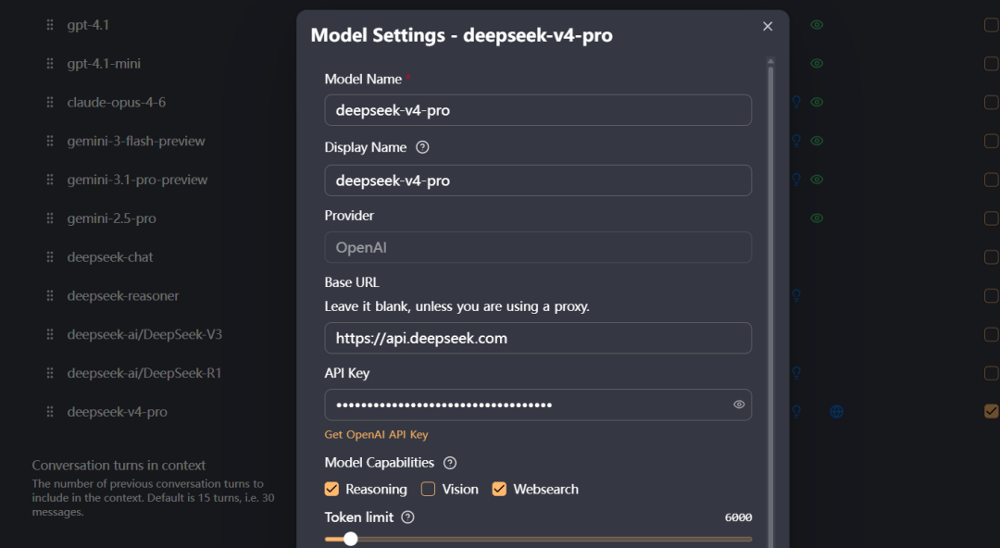

  

注意Base URL 末尾不要加`/v1`，DeepSeek 的接口地址与 OpenAI 略有不同。具体可以参考官方文档。https://api-docs.deepseek.com/zh-cn/

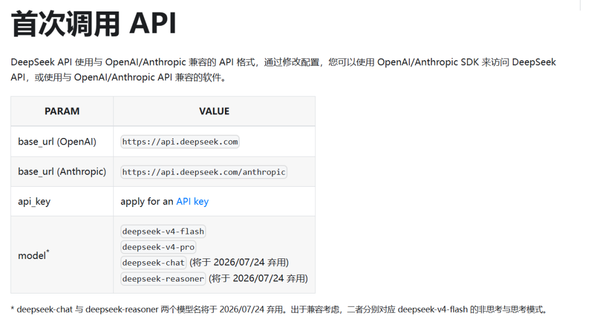

  

**Step 4：开始使用**

  * 选中笔记文字 → 右键 → Copilot → 总结/翻译/改写
  * 侧边栏对话模式 → 直接和 V4 聊天，让它基于你的笔记回答问题

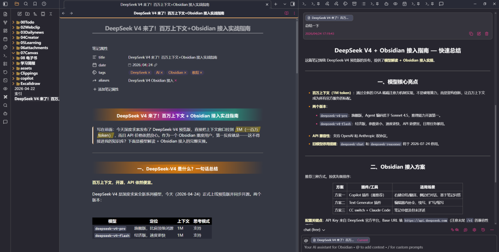  
  

### 方案二：Text Generator 插件

Text Generator 更偏向"文本生成"场景，适合在编辑器中直接补全、续写。

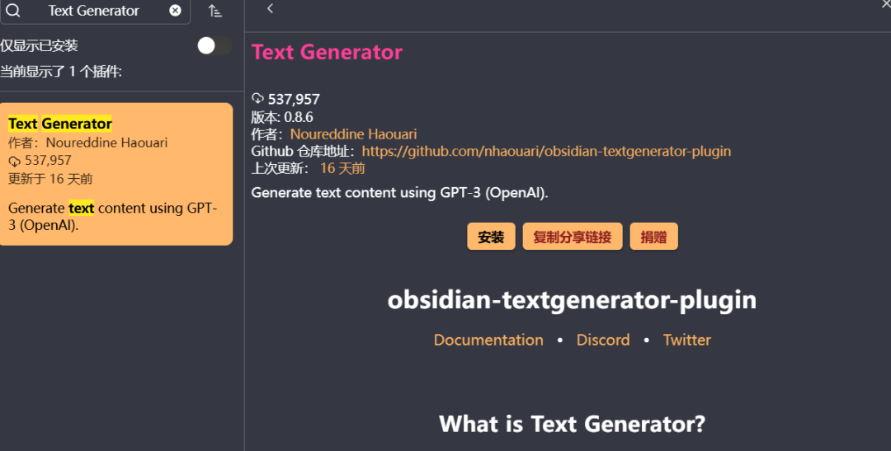

  

**配置方式：**

  1. 安装 `Text Generator` 插件
  2. 设置 → API → Provider 选择 `OpenAI`
  3. 填入：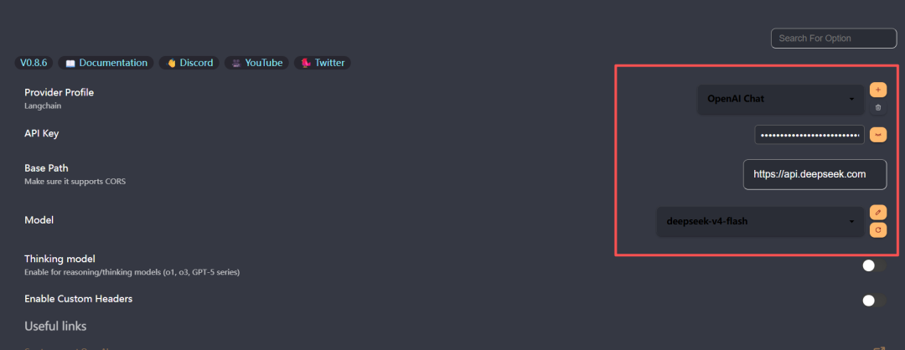  

     * API Key：DeepSeek Key
     * Base URL：`https://api.deepseek.com`
     * Model：`deepseek-v4-flash`

**典型用法：**

  * 在笔记中写一个标题，按快捷键 Ctrl + J 让 V4 自动生成内容
  * 选中一段文字，让 V4 扩写/缩写/改风格

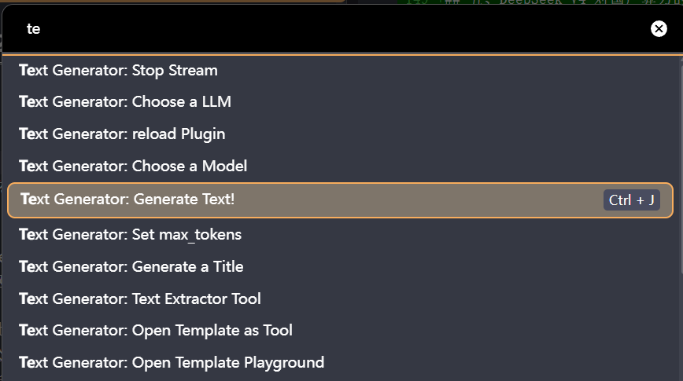  
自动扩写中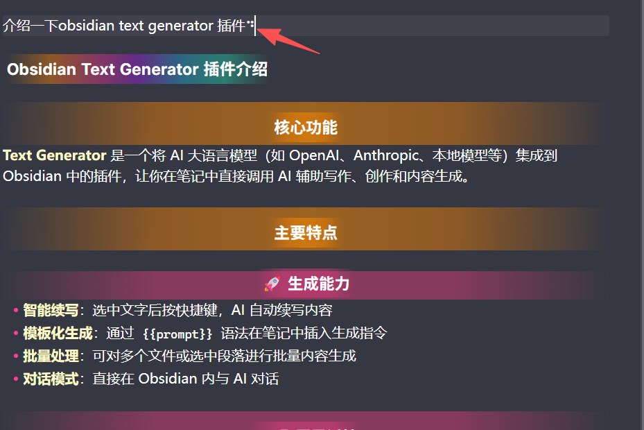  

### 方案三：CC switch + Claude Code 最推荐

更多参考：

这个方式直接在在CC switch中添加

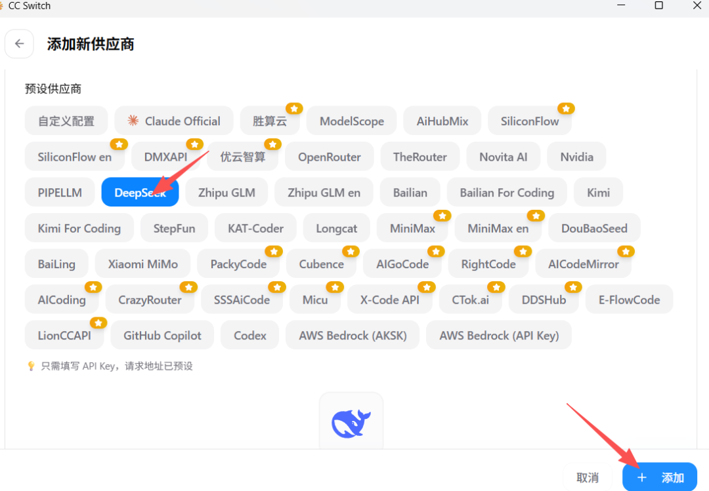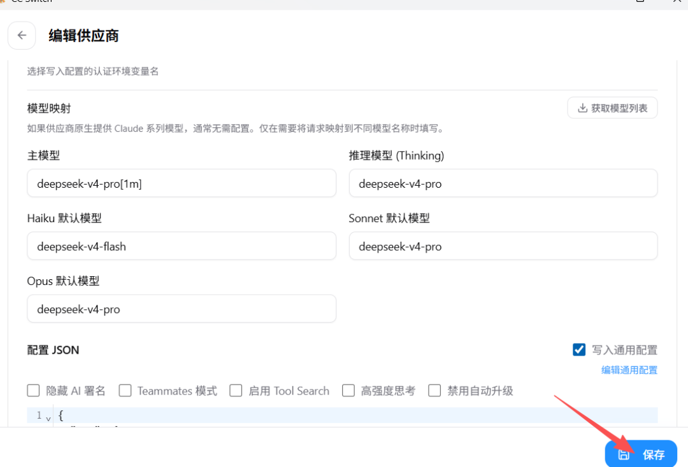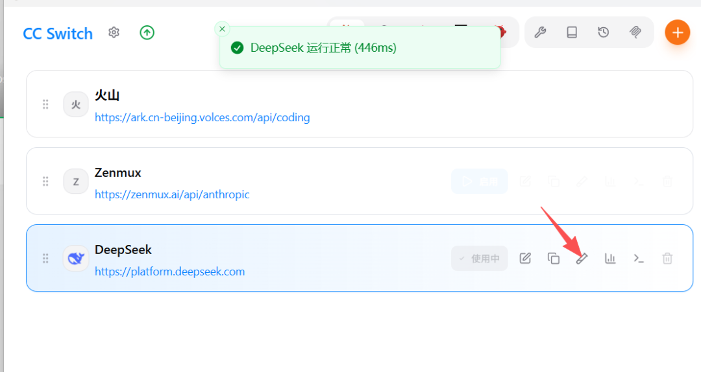

在右侧终端回答正常说明接入成功

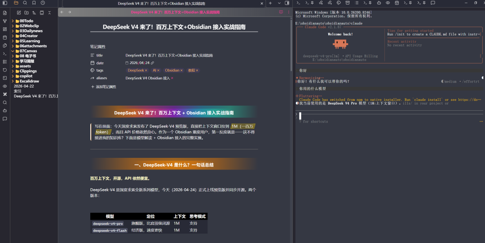

  

* * *

## 四、百万上下文在 Obsidian 里的实际意义

这才是 V4 对 Obsidian 用户最大的价值。1M 上下文意味着：

  * 整个知识库可以直接丢进去对话，不用精心挑选"相关笔记"
  * 长文档分析不再需要分段处理
  * 多笔记关联分析、跨笔记推理成为可能

**举个真实场景：**

你的 Obsidian 里有 50 篇项目笔记，总计约 20 万字。以前用 GPT-4 的 128K 上下文，只能挑几篇放进去。现在用 V4 的 1M 上下文，可以直接把所有笔记拼起来一次投喂，让 AI 做全局分析、发现跨笔记的关联、生成项目全景报告。

**实操建议**  
用 Copilot 的"笔记上下文"功能，将当前文件夹下的笔记批量加入对话上下文，配合 V4 的 1M 窗口，真正实现"和知识库对话"。

**省钱技巧**  
简单任务用 `deepseek-v4-flash`，只有需要深度推理时才切换到 `deepseek-v4-pro` \+ 思考模式。日常笔记处理 Flash 完全够用。

* * *

## 六、总结

  
DeepSeek-V4 的发布，让"百万上下文 + 个人知识库"的组合真正落地了。以前觉得 1M 上下文是实验性功能，现在它成了标配——而且 API 价格普通用户也承担得起。  
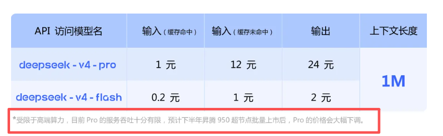

  

这次DeepSeek V4 这次在国产算力生态的适配上下了大功夫，可以说是目前对国产芯片支持最好的开源大模型。国产算力的单位推理成本正在快速下降，而这只是开始。

  
如果你是 Obsidian 用户，今天就可以动手接入了。10 分钟配好，你的知识库就能和 AI 真正对话。

* * *

如果本文恰好帮到你，不妨点赞+收藏+分享，让科叔知道你来过！❤️

  
以上就是今天的分享内容，我们下期见。  
  

END

  
**< 精选教程合集>******#Obsidian #claude code #AI自动化 #AI工作流 #skills